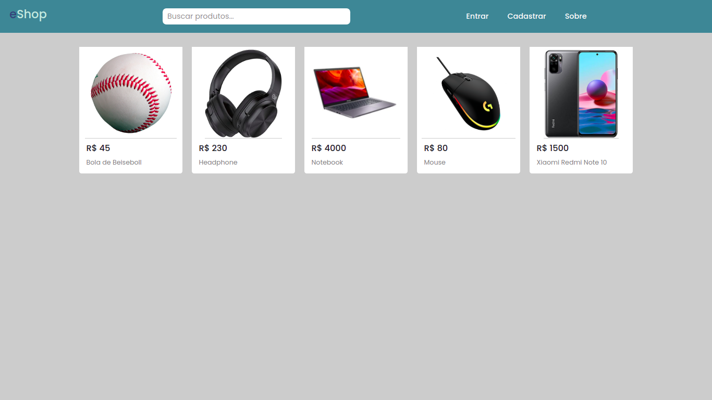

<h1 align="center">eShop</h1>

<p align="center">
  
  
  <a href="https://github.com/jtiagosantos/url-shortener/commits/master">
    
  </a>
  
   <a href="https://github.com/jtiagosantos/url-shortener/stargazers">
    
  </a>
</p>

<h4 align="center"> 
	🚧  eShop ✂️ Completed(90%) 🚀 🚧
</h4>

<p align="center">
  <a href="#-features">Features</a> •
  <a href="#-run-project">Run Project</a> • 
  <a href="#-technologies">Technologies</a> • 
  <a href="#-author">Author</a> • 
  <a href="#-license">License</a>
</p>

<br>

<h1 align="center">
    
</h1>

<hr />

## ⚙️ Features

- [x] See the products
- [x] See a specific product
- [x] Add product to cart
- [x] Update quantity of a product in cart
- [x] Remove product from cart
- [x] Close purchase 
- [x] Add product(admin)
- [x] Product photo upload(admin)
- [x] Update product(admin)
- [x] Delete product(admin)
- [x] Add administrator(admin)   
- [x] Remove administrator(admin)
- [x] Add address
- [x] Delete address

<hr>

## 🚀 Run Project

1️⃣ Clone project and access its folder:

```bash
$ git clone https://github.com/jtiagosantos/e-shop.git
$ cd e-shop
```

2️⃣ Install dependencies:

```bash
$ cd backend
$ npm i 
$ cd ../frotend
$ npm i
```

3️⃣ Create an .env file in the backend folder as below:

```bash
JWT_SECRET_KEY=key
```

4️⃣ Run seed to add admin:

```bash
$ npm install -g mongo-seeding-cli
$ cd backend
$ seed -u mongodb://127.0.0.1:27017/eshop --drop-database ./database/data
```

🔐 Administrator data:

- E-mail: admin_admin42@eshop.com
- Password: r2kw4ycg

5️⃣ Start project:

```bash
$ cd ../backend
$ docker-compose up --build
$ cd ../frontend
$ yarn start
```

<hr>

## 🛠 Technologies

The following tools were used in the construction of project:

**💻 Frontend**:

- React
- Typescript
- Styled Components
- Context API
- React Router Dom
- React Hook Form
- React Toast
- Axios

**📶 Backend**:

- Node.Js
- Docker
- Docker Compose
- Express
- Nodemon
- JWT
- Bcryptjs
- Validator
- Dotenv
- Cors
- Mongoose
- Multer

**💾 Database**:

- Mongodb
- Redis

<hr>

## 👨‍💻 Author


<strong><a href="https://github.com/jtiagosantos">Tiago Santos </a>🚀</strong>

[](https://www.linkedin.com/in/josetiagosantosdelima/)
[](mailto:tiago.santos@icomp.ufam.edu.br)

<hr>

## 📝 License

This project is under license [MIT](./LICENSE).
